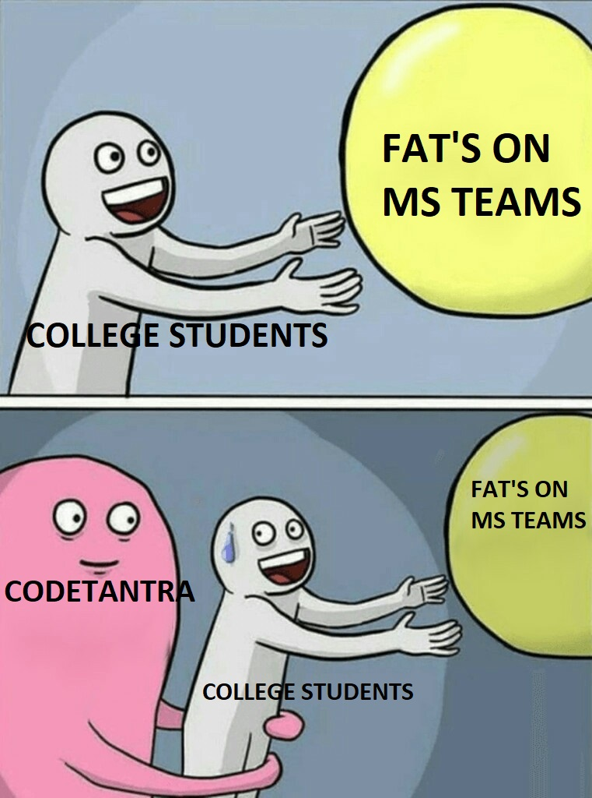
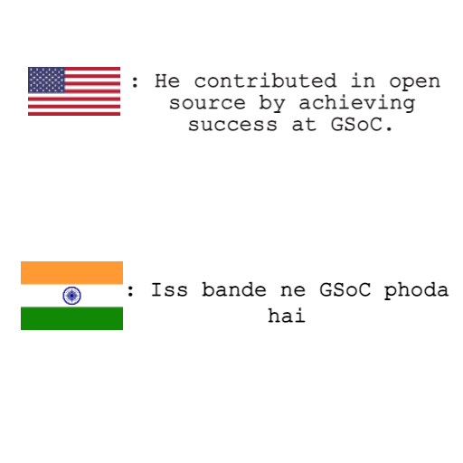
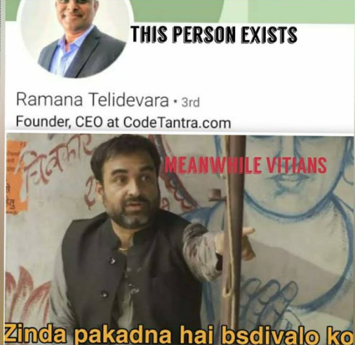
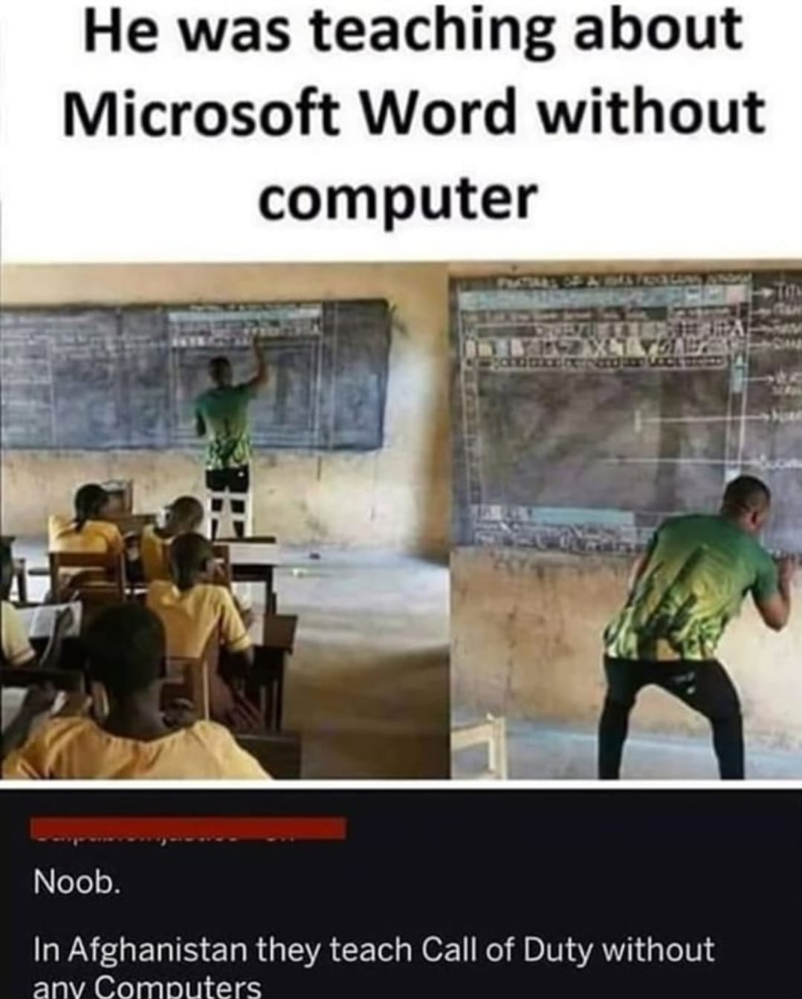

# Core-GitHub-Practice

Core members GitHub practice. May the best meme wins!

## Instructions:

```
Fork this Repository

Clone it to your PC

Add your meme into the memeImages folder

Commit and push

Create a PR

Star this repository

Wait for PR to merge

Celebrate!
```

Read about markdown syntax [HERE](https://github.com/adam-p/markdown-here/wiki/Markdown-Cheatsheet)

## The Real Game 🏄🏻‍♂️ 🏃‍♂️

| |First Name  | Last Name |Username | Meme |
|--|--|--|--|--|
| 1 | Dhairya |Ostwal|[dhairyaostwal](https://github.com/dhairyaostwal/)||
| 2 | KATHIRESAN |PL|[kathiresan0907](https://github.com/kathiresan0907/)|
| 3 | Arya  |Wadhwani|[Arya-Wadhwani07](https://github.com/Arya-Wadhwani07/)||
| 4 | Test |Test|[Test]()||
| 5 | Alok |Mathur|[alokm]()||
| 6 | Aditya |Jain|[adityajain](https://github.com/Aditya0908/)|
| 7 | Nirad |Yeola|[nirad17](https://github.com/nirad17/)||
| 8 | Shreyansh |Singh|[SHREYANSHSINGH14](https://github.com/SHREYANSHSINGH14/)||
| 9 | Naman |Jain|[naman26jain](https://github.com/naman26jain/)||
| 10 | Priyanka |Govindarajan|[priyanka-111-droid]()||
| 11 | Sambhav |Mahajan|[sambhavmahajan11](https://github.com/sambhavmahajan11/)||
